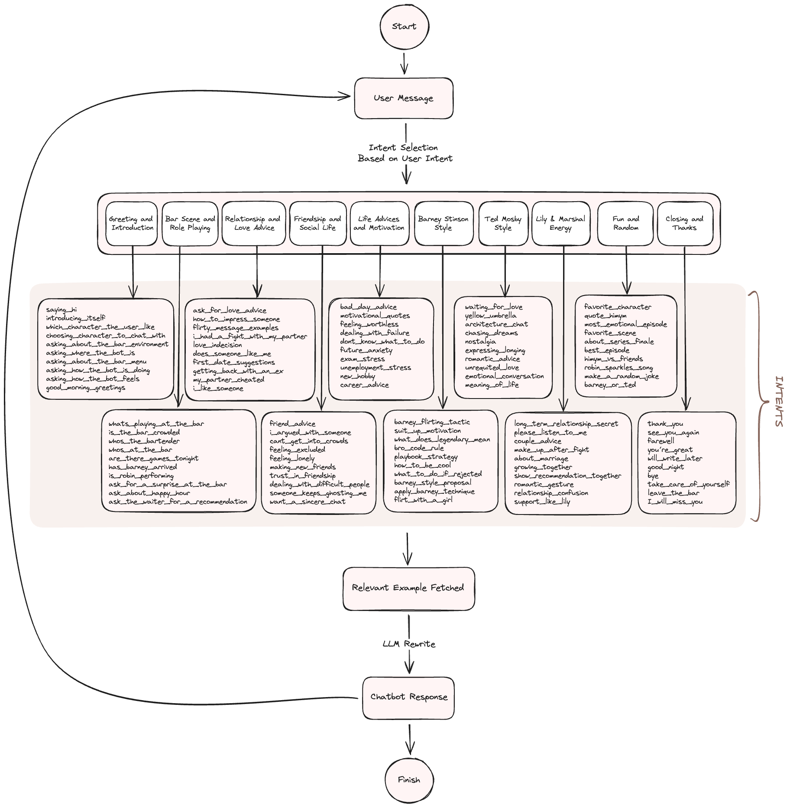
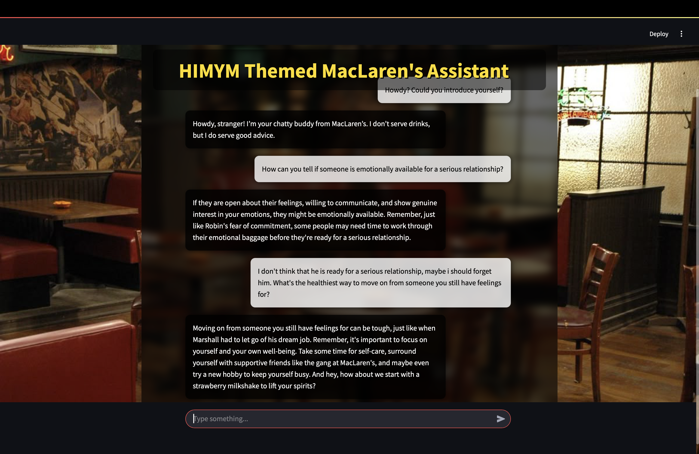
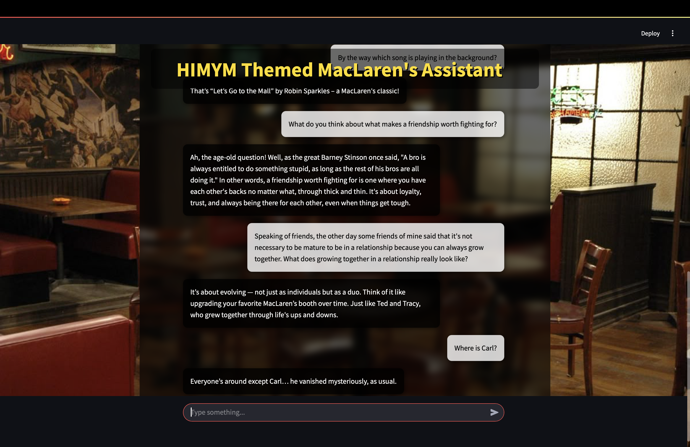

# MacLaren's Assistant – HIMYM Themed RAG Chatbot with Intent Evaluation

**MacLaren's Assistant**, How I Met Your Mother (HIMYM) evreninden ilham alan, kullanıcı mesajlarını analiz edip niyetini (intent) tanımlayan ve karakter temalı yanıtlar üreten bir sohbet botudur. Sistem, hem OpenAI hem de Ollama (Mistral) destekli modellerle çalışmakta ve modellerin performanslarını karşılaştırmalı olarak sunmaktadır.

Kullanıcı ilişki tavsiyeleri, arkaadaşlık ve sosyal hayat, hayat tavsiyeleri ve motivasyon gibi konularda chabtot ile konuşabileceği gibi içecek tavsiyesi, himym karakterleri veya ortama özel muhabbet de edebilmektedir.

> “Because sometimes, even when you know how something’s gonna end, that doesn’t mean you can’t enjoy the ride.” – Ted Mosby  

---

## 📁 Proje Dosya Yapısı

```
project-root/
│
├── app.py                       # Streamlit tabanlı ön yüz
│
├── assets/
│   ├── chat_ui_1.png            # Arayüz görseli
│   └── chat_ui_2.png            # Arayüz görseli
│
├── evaluation/
│   ├── evaluate_openai.py       # OpenAI intent sınıflandırması ve değerlendirme
│   └── evaluate_ollama.py       # Ollama Mistral intent sınıflandırması ve değerlendirme
│
├── models/
│   ├── openai_model.py          # OpenAI RAG modeli tanımı
│   └── ollama_model.py          # Ollama RAG modeli tanımı
│
├── data/
│   └── chatbot_dataset.xlsx     # Intent, mesaj, yanıt içeren veri kümesi
│
├── .env                         # API anahtarları
└── README.md                    # Bu dosya
```

---

## 📊 Veri Kümesi

Proje, HIMYM dizisine özgü kullanıcı mesajlarını, bunlara karşılık gelen chatbot yanıtlarını ve niyet etiketlerini içeren özel bir veri kümesini kullanmaktadır. Veri seti bu proje için üretilmiş olup çeşitli projelerde kullanıma açıktır. Vei setine Kaggle platformu üzerinden erişilebilmektedir.

- **Veri Özellikleri:**
  - Intent (niyet) etiketi
  - Kullanıcı mesajı
  - Yanıt

🔗 [MacLaren's Chat – A HIMYM Themed Chatbot Dataset (Kaggle)](https://www.kaggle.com/datasets/sudenurtunga/maclarens-chat-a-himym-themed-chatbot-dataset/data)

---
## 💬 Chatbot Akışı Tasarımı
Chatbot aşağıdaki intent (niyet) örnekleri gibi konularda kullanıcının temel sorularına cevap verebilmektedir.



---

## 🧠 Kullanılan Modeller ve Araçlar

### 🚀 Neden Bu Modeller?

- **OpenAI (GPT-3.5 + Embedding v3):**
  - Yüksek doğruluk, genel amaçlı kullanıma uygunluk, cevap kalitesi
  - Cloud tabanlı erişim ve hızlı yanıt süresi
- **Ollama + Mistral 7B:**
  - Lokal çalışma imkanı, açık kaynak ve ücretsiz kullanım avantajı
  - İnternete ihtiyaç duymadan çalışabilirlik


### 🛠️ Kullanılan Araçlar ve API’ler

| Araç / Kütüphane      | Açıklama                                 |
|-----------------------|------------------------------------------|
| `LangChain`           | RAG (Retrieval-Augmented Generation) altyapısı |
| `ChromaDB`            | Vektör veritabanı                        |
| `Streamlit`           | Web tabanlı chatbot arayüzü              |
| `scikit-learn`        | Değerlendirme metrikleri (F1, Precision vb.) |
| `dotenv`              | API anahtarlarının güvenli kullanımı     |
| `Ollama`              | Yerel LLM çalıştırma aracı (örn. Mistral gibi modellerle) |
| `OpenAI`              | GPT tabanlı API ile bulut üzerinden model çalıştırma         |

> 📝 Not: `Ollama`, yerel olarak LLM modelleri (ör. `mistral`) çalıştırmanıza olanak tanır. 
> Kullanmak için sisteminizde `ollama` servisinin kurulu ve çalışıyor olması gerekir. 
> Daha fazla bilgi için: [https://ollama.com](https://ollama.com)


### 🔐 OpenAI API Anahtarı Alımı

1. [https://platform.openai.com/account/api-keys](https://platform.openai.com/account/api-keys) adresinden API anahtarınızı oluşturun.
2. `.env` dosyası içine şu şekilde ekleyin:

```bash
OPENAI_API_KEY=your_openai_key_here
```

---

## ⚙️ Uygulama Kullanımı

### ✅ Model Seçimi

`app.py` dosyasının en üst kısmında aşağıdaki satırları göreceksiniz:

```python
# -------------------- chose model from here -------------------- 
# from models.openai_model import build_chat_chain
# from models.ollama_model import build_chat_chain
```
Kullanmak istediğiniz modele göre yorum satırını kod satırı haline getirmeniz gerekir:

- OpenAI kullanacaksanız:
```python
from models.openai_model import build_chat_chain
```
- Ollama (Mistral) kullanacaksanız:
```python
from models.ollama_model import build_chat_chain
```
Değişikliği yaptıktan sonra uygulamayı başlatabilirsiniz:

### Arayüz Başlatma (Chatbot):
- OpenAI kullanacaksanız:
```bash
streamlit run app.py
```
- Ollama (Mistral) kullanacaksanız:
```bash
ollama serve
ollama run mistral
streamlit run app.py
```

### Değerlendirme Script’leri:

#### OpenAI:
```bash
python evaluate_openai.py
```

#### Ollama (Mistral):
```bash
ollama serve
ollama run mistral
python evaluate_ollama.py
```
---
## 🖼️ HIMYM Temalı Sohbet Örneği - Arayüzden Görseller

Chatbot arayüzü örnekleri aşağıda gösterilmiştir:




---

## 📈 Model Performansı Karşılaştırması

Modeller aşağıdaki metriklerle değerlendirilmektedir:

- **Accuracy
- **Precision
- **Recall
- **F1 Score

**Çıktı:**

| Model              | Accuracy | Precision | Recall | F1 Score |
|--------------------|-----------|--------|----------|----------|
| OpenAI (GPT-3.5)   | 0.51      | 0.47   | 0.51     | 0.47     |
| Ollama (Mistral 7B)| 0.40      | 0.40   | 0.42     | 0.39     |

> Not: Intent sayılarının fazlalığından ötürü model intent başına ortalama 8 örneği kaynak olarak kullanmış ve 2 örnek ile tahmin yapmıştır. Başarının artması için intent başına düşen örnek sayısının artırılması gerekmektedir.

> Not: Veri setinden test verisinin ayrılması aşamasında `random state` değeri aynı tutulmuş ve modellerin aynı örnekler ile test işlemini yapması sağlanmıştır.

---
## 👨‍💻 Katkı Sağla

Yeni intent'leri Barney replikaları ya da model iyileştirmeleri mi düşündün? PR'lara açığız!
---

## 📄 Lisans

Bu proje, [Apache License 2.0](https://www.apache.org/licenses/LICENSE-2.0) lisansı kapsamında sunulmaktadır.

Yazılımı kullanmakta, çoğaltmakta, dağıtmakta ve değiştirmekte özgürsünüz.  
Ticari kullanım da serbesttir.  
Ancak, telif hakkı bildirimleri ve lisans metni korunmalı ve proje ile birlikte yer almalıdır.

Tam metin için [LICENSE](./LICENSE) dosyasını inceleyebilirsiniz.
